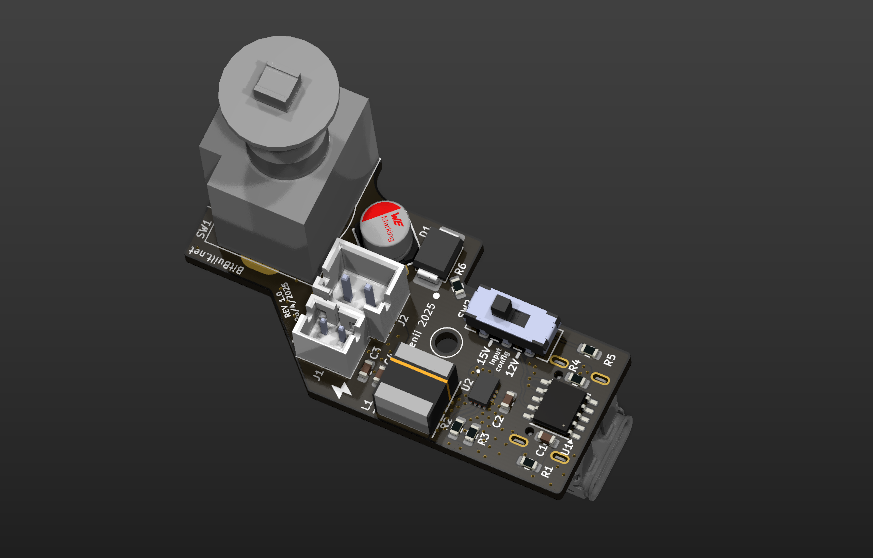

<picture> <source media="(prefers-color-scheme: dark)" srcset="Images/Logo-Light.png" width="800">  </picture> 

USB-GC2 is new generation GameCube Power Board. It allows powering the console with USB-C Power Delivery.
It also contains a switch to select between 12V or 15V input, making it compatible with a variety.
This second revision also integrates securities, which protects the GameCube for voltage spikes.
But most importantly, USB-GC2 is now open-source!
 

